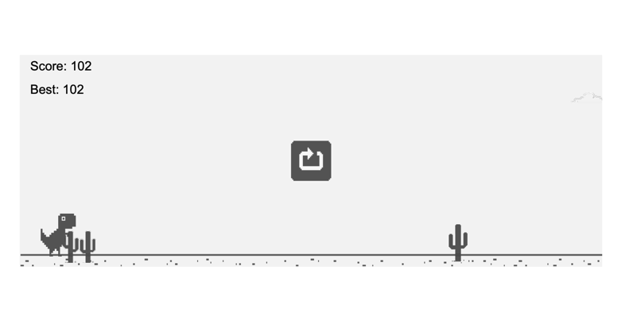

# 🦖 PDF Dino

A recreation of Google's Chrome Dino game that runs **entirely inside a PDF** using PDF JavaScript and interactive form fields.

This project is inspired by:

- 🎮 **PDFtris** by Thomas Rhinsma
- 🐦 **Flappy Bird in PDF** by [ADT](https://www.youtube.com/@ADTDev)

A huge thank you to **@deadt** and everyone in the **ADT Discord** for their help, ideas, and encouragement throughout the project.

## ▶️ How to Play

1. Download the PDF.
2. Open it in a **Chromium-based browser** (Google Chrome, Microsoft Edge, Brave, Opera, etc.).
3. Click anywhere in the game area to jump.
4. Avoid the cacti and survive as long as possible!

> **Note:** The game is designed for Chromium-based PDF viewers. Other PDF viewers (including Firefox's built-in viewer and Adobe Acrobat) may not behave correctly due to differences in PDF JavaScript support.

## 🙏 Credits

- Thomas Rhinsma — **PDFtris**
- ADT — **Flappy Bird in PDF**
- @deadt
- [Members of the ADT Discord community](https://discord.com/invite/TKNuBS7X28)

## 📜 License

This project is shared for educational and experimental purposes.
